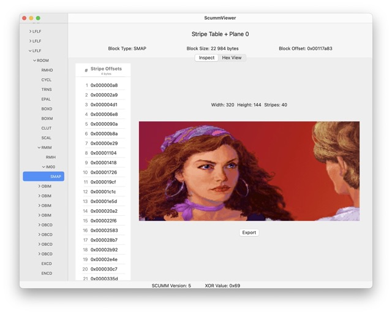
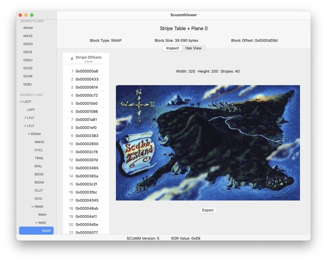
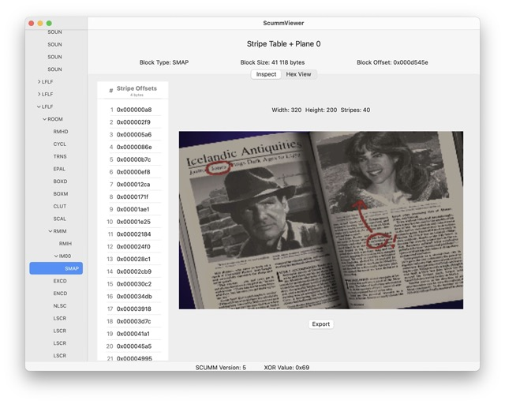

# ScummKit

> **ScummKit** — a modern Swift reimplementation of the classic LucasArts **SCUMM engine**, with a primary focus on **v5**, the version behind *Monkey Island 2* and *Indiana Jones and the Fate of Atlantis*.

<table>
<tr>
<td align="center">
  <br/>
  Monkey Island 1
</td>
<td align="center">
  <br/>
  Monkey Island 2
</td>
<td align="center">
  <br/>
  Indiana Jones and the Fate of Atlantis
</td>
</tr>
</table>

---

## About

ScummKit is an open-source toolkit for exploring SCUMM games and for creating and running **point-and-click adventures** in the LucasArts tradition.

The project began as a small SwiftUI prototype (**ScummViewer**) to render original SCUMM background graphics. That experiment led deeper into SCUMM’s internals — inspecting resources, decompiling scripts, and eventually building a new compiler inspired by *Crafting Interpreters* and classic SCUMM documentation.

Today, ScummKit consists of:

- **SCUMM Compiler (usable, in development):**  
  A bytecode compiler for SCUMM v5 scripts, written in Swift.  
  This is currently the most functional part of the project.  

- **SPUTM Virtual Machine (placeholder):**  
  Intended to run the compiled bytecode.  
  Currently just a scaffold project; execution is not yet implemented.  

- **ScummCompiler Swift Package (core technology):**  
  The shared library powering both the compiler and the VM.  
  It includes the compiler frontend, backend, intermediate representation, runtime, and a decompiler.  

- **Legacy Prototypes:**  
  Tools like **ScummViewer**, which can render backgrounds and explore resources, are kept for historical/learning purposes but are **not actively maintained**.

⚠️ **Current focus:** SCUMM **v5**.
Preliminary work exists for v4 and other versions, but these remain experimental and are **not officially supported**.

## Repository Structure

This repository is a **monorepo** containing all ScummKit components:

- **`ScummCompiler/`** — Swift package with the **core compiler technology**:  
  compiler frontend, backend, intermediate representation (IR), runtime, and decompiler.  
  This is the foundation used by both the CLI (`SCUMM/`) and VM (`SPUTM/`).  

- **`SCUMM/`** — Terminal frontend (CLI) for the compiler.  
  Building this provides the `scumm` tool.  

- **`SPUTM/`** — Virtual Machine (VM) project intended to run compiled bytecode.  
  Currently a placeholder scaffold (runtime not yet implemented).  

- **`ScummCore/`** — Swift package with SCUMM internals:  
  resource and file handling, room definitions, platform/version handling, etc.  

- **`ScummViewer/`** — Prototype SwiftUI app to display SCUMM graphics and browse resources.  
  Useful as a historical reference, but not maintained.  

- **`ScummInterpreter/`** — Obsolete prototype of an interpreter.  
  Kept for archival purposes; will be removed in future cleanup.  

- **`ScummKit.xcworkspace`** — Xcode workspace for building the entire monorepo.  

## Status

Current maturity of ScummKit components:

| Component                  | Status            | Notes |
|----------------------------|------------------|-------|
| **SCUMM Compiler**         | ✅ Usable (WIP)   | Compiles SCUMM v5 scripts to bytecode. |
| **SPUTM Virtual Machine**  | 🚧 Placeholder    | Project scaffold; execution not yet implemented. |
| **ScummCompiler Package**  | ✅ Core library   | Provides frontend, backend, IR, runtime, and decompiler. |
| **ScummCore Package**      | ⚠️ Partial        | Resource and file handling, rooms, versions. |
| **ScummViewer**            | ⚠️ Prototype      | Renders graphics, explores resources. Historical only. |
| **ScummInterpreter**       | ❌ Obsolete       | Early interpreter prototype; slated for removal. |

Good catch — thanks for flagging that. Since the compiler is an **app target inside the Xcode workspace** (not an SPM package), here’s a corrected **Getting Started** you can drop in:

## Getting Started

### Prerequisites

- **macOS 14 (Sonoma)** or later  
- **Xcode 15.0+** (Xcode 15 shipped with Sonoma 14; newer versions like 15.3 or 15.4 may require 14.4+ or 14.5+)  
- **Swift 5.x** (toolchain depends on Xcode version)  
- Git

---

### 1) Build the Compiler CLI (Xcode workspace)

**Option A — Xcode UI (easiest)**  
1. Open the workspace: `ScummKit.xcworkspace`  
2. Select the **SCUMM** scheme (the CLI frontend for the compiler)  
3. Set the destination to **My Mac**  
4. Choose **Product ▸ Build**  

This builds the CLI (`scumm`) and lets you run it inside Xcode’s console.  
To run it outside Xcode, locate the binary in DerivedData, e.g.:  
```

\~/Library/Developer/Xcode/DerivedData/ScummKit-<random-hash>/Build/Products/Debug/scumm

```

---

**Option B — Command line (predictable output path)**  
Build to a local `.build` directory so you know exactly where the binary lands:

```bash
xcodebuild \
  -workspace ScummKit.xcworkspace \
  -scheme SCUMM \
  -configuration Debug \
  -destination 'platform=macOS' \
  -derivedDataPath .build \
  build
````

Resulting binary:

```
.build/Build/Products/Debug/scumm
```

---

### 2) Quick try: REPL

Run the compiler **with no arguments** to enter REPL mode:

```bash
.build/Build/Products/Debug/scumm
```

Type an expression (arithmetic is supported today), then press **Return**:

```
(-1 + 2) * 3 - -4
```

Use **Ctrl‑D** (EOF) to exit the REPL.

> Tip: The REPL is great for sanity‑checking tokenization/parsing while the runtime is still under construction.

---

### 3) Compile a `.scu` script (to bytecode)

Create a file (e.g. `examples/hello.scu`) with a simple expression:

```scumm
(-1 + 2) * 3 - -4
```

Compile it to **ScummKit Bytecode** (`.sbc`):

```bash
.build/Build/Products/Debug/scumm examples/hello.scu -o build/hello.sbc
```

This produces `build/hello.sbc` (bytecode).
Execution in the VM is not implemented yet.

---

### 4) Developer tools (AST / decompile)

Pretty‑print the **Abstract Syntax Tree**:

```bash
.build/Build/Products/Debug/scumm --pretty examples/hello.scu
```

Decompile using the **xray** runtime (disassembler view):

```bash
.build/Build/Products/Debug/scumm --runtime=xray --backend=scumm examples/hello.scu
```

---

### 5) Run the VM (SPUTM - status: placeholder)

The `SPUTM` scheme is also part of the Xcode workspace, but at this stage it is only a **placeholder app**.  
You can build it, but execution is not implemented yet.

### 6) (Optional) Explore assets with ScummViewer

`ScummViewer/` is a **historical prototype** to browse SCUMM resources and render backgrounds.

**Xcode UI**

1. Open `ScummKit.xcworkspace`
2. Select the **ScummViewer** scheme
3. Destination: **My Mac**
4. **Product ▸ Run**

**Command line**

```bash
xcodebuild \
  -workspace ScummKit.xcworkspace \
  -scheme ScummViewer \
  -configuration Debug \
  -destination 'platform=macOS' \
  -derivedDataPath .build \
  build
open .build/Build/Products/Debug/ScummViewer.app
```

## Roadmap

ScummKit will ship in phases:

1. **Compiler v5 baseline** — expression eval, statements, variables, control flow, functions; stable bytecode format.
2. **Decompiler parity** — round‑trip for all implemented opcodes.
3. **SPUTM VM (MVP)** — load `.sbc`, execute core opcodes, basic I/O hooks.
4. **Resources & Rooms** — loading and addressing of rooms, actors, objects (via ScummCore).
5. **Tooling** — test fixtures, CLI ergonomics, CI builds, docs site.
6. **IDE (exploratory)** — editor UI for scripts/resources; modern “Mojo” experiments.

## Documentation

- Getting Started (this README)  
- **Specs & Notes** (WIP):  
  - `docs/spec/bytecode.md` — SCUMM v5 bytecode format (ScummKit variant)  
  - `docs/spec/runtime.md` — runtime ABI and calling conventions  
  - `docs/notes/` — implementation notes, design decisions

More guides will land in `/docs` as features stabilize.

## Contributing

Contributions are welcome!  
Please read:

- `CONTRIBUTING.md` — how to set up, style, test, and submit PRs
- `CODE_OF_CONDUCT.md`

Good first issues are labeled **good first issue** and **help wanted**.

## License

GPL-3.0 — see `LICENSE`.

> Note: A more permissive license (MIT/Apache‑2.0) may be considered for parts of the stack in the future to enable broader adoption.

## Support

If you want ScummKit to grow:

- ⭐ Star this repo
- 🗣️ Share feedback in Discussions
- 🧪 Try the REPL and report issues
- ❤️ Sponsor development (coming soon)

---

## Key Features (current)

- Swift‑based **SCUMM v5** compiler (in development)
- **Decompiler** for implemented bytecode
- **REPL** for quick syntax/parse checks
- Modular core (`ScummCompiler`) with frontend, backend, IR, runtime
- Historical **ScummViewer** to inspect resources and backgrounds

## Technical Highlights

- **Two parser frontends**: `decent` and `pratt` (choose via `--frontend`)
- **Backends**: `scumm` (current), `mojo` (experimental target)
- **Runtimes**: `scumm`, `mojo`, `xray` (disassembler)
- **IR‑first design** for easier backend and tooling evolution
- **Xcode workspace** with CLI target + modular Swift Packages

## Screenshots

Additional images and short clips live in `docs/images/`.
